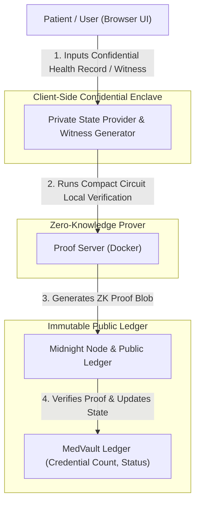
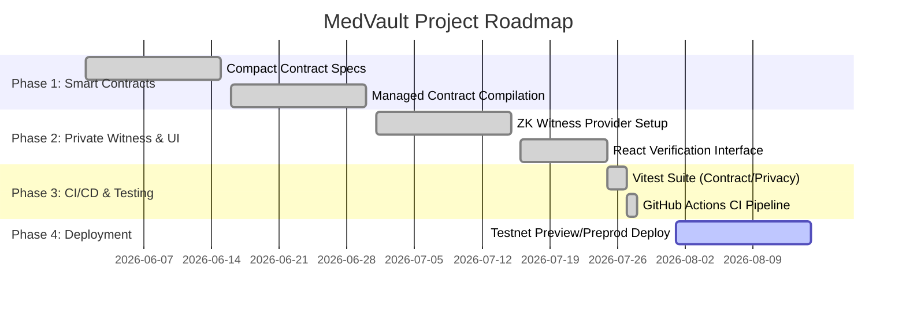

# 📜 MedVault Proposal: Zero-Knowledge Medical Records Platform

[](https://github.com/bc2ananyaghosh-dot/MEDICAL/actions/workflows/ci.yml)
[](https://nodejs.org/)
[](LICENSE)
[](https://midnight.network/)
[](https://github.com/bc2ananyaghosh-dot)

---

## 1. 🌟 Executive Summary

**MedVault** is a decentralized, Zero-Knowledge (ZK) privacy-preserving medical records and healthcare credential verification platform built on the **Midnight Network**. 

By leveraging **Compact smart contracts** and Midnight's dual-state architecture (Public Ledger + Private State), MedVault enables patients, hospitals, doctors, and health insurance providers to generate and verify cryptographically tamper-proof health credentials without exposing sensitive Personal Health Information (PHI), medical diagnosis records, or confidential patient identities.

---

## 2. 🎯 Problem Statement & Core Objectives

### The Problem
Traditional electronic health record (EHR) and medical credential verification systems suffer from:
- **Privacy Vulnerabilities:** Centralized health databases expose patient records to data breaches and unauthorized access.
- **Over-Disclosure:** Patients must present full clinical histories or identity documents just to prove a single attribute (e.g., vaccination status, grant eligibility, or institution affiliation).
- **Compliance Friction:** Managing HIPAA, GDPR, and medical board audit requirements creates administrative overhead.

### Key Objectives
- **Zero Data Leakage:** Ensure 100% mathematical zero-leakage of private health records and secrets using ZK proofs.
- **Selective Disclosure:** Allow users to present verifiable proofs of eligibility, credentials, or authorship without revealing underlying documents.
- **Tamper-Proof Auditability:** Register credential hashes and verification statuses on the immutable Midnight public ledger.
- **Seamless Developer & User Experience:** Integrated frontend application with local devnet docker compose setup and automated GitHub CI testing.

---

## 3. 🏗️ System Architecture



### Core Components

1. **Compact Smart Contracts (`contracts/medvault.compact`)**:
   - Defines the public state (credential count, verification count, revocation statuses).
   - Implements circuits for credential registration, ZK proof verification, and credential revocation.

2. **Witness & Private State Engine (`src/witness.ts`)**:
   - Holds patient/author secrets, institution keys, and manuscript/record hashes locally.
   - Computes deterministic proof hashes without writing confidential string data to the ledger.

3. **Midnight Network Stack (`docker-compose.yml`)**:
   - Local devnet featuring Midnight Node (port 9944), GraphQL Indexer (port 8088), and ZK Proof Server (port 6300).

4. **Frontend & Verification UI (`src/pages/`)**:
   - Modern React/TypeScript UI for managing medical vaults, verifying credentials, and connecting wallets via `@midnight-ntwrk/wallet-sdk`.

---

## 4. 🔬 Zero-Knowledge Verification Model

| Feature / Credential | Public On-Chain Ledger Data | Private Witness Data (Hidden) |
| :--- | :--- | :--- |
| **Authorship / Research Proof** | Credential ID, Institution Hash, Timestamp | Full Clinical Draft, Abstract, Secret Keys |
| **Reviewer Credential** | Verification Count, Eligibility Flag | Reviewer Secret Token, Clinical Record Count |
| **Grant Eligibility** | Boolean Status, Public Identifier Hash | Patient Identity, ORCID ID, Financial Data |
| **Credential Revocation** | `isRevoked: true` ledger flag | Private Reason & Internal Institution Note |

---

## 5. 🚀 Milestone & Implementation Roadmap



---

## 🧪 6. Testing & Continuous Integration (CI)

The repository is monitored continuous integration using **GitHub Actions**.

### Test Suite Coverage
- **Contract Integration Tests (`tests/contract.test.ts`)**: Validates ledger initialization, credential registration, proof verification, and revocation logic.
- **Privacy Model Tests (`tests/privacy.test.ts`)**: Verifies 0% confidential string leakage in serialized proof blobs.
- **UI & Wallet Tests (`tests/ui.test.tsx`, `tests/wallet.test.ts`)**: Ensures component rendering and wallet state management.
- **Configuration Tests (`tests/config.test.ts`)**: Validates network settings across `undeployed`, `preview`, and `preprod`.

### Running Tests Locally

```bash
# Run complete Vitest suite
npm run test

# Type-check TypeScript codebase
npm run typecheck

# Execute end-to-end network tests
npm run test:e2e
```

---

## 📄 7. License

This project is licensed under the **MIT License**.
